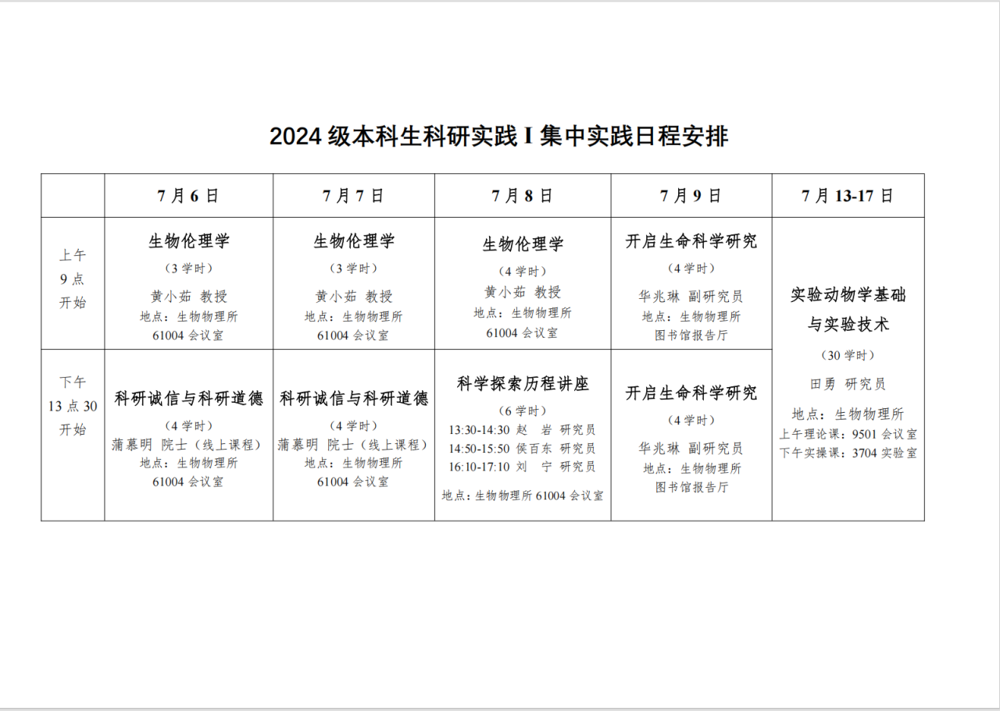

# 集中教学心得(吐槽)

## 前言

集中教学是生物科学专业不得不品鉴的一环，会严重创飞你的暑假。

以 2026 年为例：7 月 2 日考完最后一门试，7 月 6 日开始实践，一直到7月17日。具体安排如下：

## 第一周：讲座与课程

### 1. 生物伦理学讲座

顾名思义，是伦理学相关的内容。讲座本身没有问题，但这个安排非常迷惑：不是请老师到湖里，而是把一大巴车的学生拉到城里去听。

### 2. 科研诚信与科研道德

好几年前蒲慕明院士录的线上课。讲座本身蛮有意思，但我不明白为什么要把人集中拉过来，看一个自己在家就能看的视频。

### 3. 科学探索历程讲座

会请组里的几位研究员介绍自己的方向。这可能是唯一还说得上有现场价值的环节。未来可以多请几位老师、把这个部分扩大；其他意义不明的内容，就没必要让我们一天坐三个小时车来回奔波了……

### 4. 开启生命科学研究

同样是一场讲座。

## 考核与反馈

上面几个环节中，除了研究方向介绍以外，都有小测和考试。每天到场时需要签到，中午 11 点多到 12 点放学。

对于觉得不合理的安排，可以及时和老师沟通、提出意见。我们这次实践期间，同学反馈过后，时间安排就变得人性化了很多。

我觉得下一届可以在学期中安排还没出来的时候提前挣扎一下，争取把讲座适当分散到学期内，把看网课这个环节改成各自观看视频。把一些不是非到所里不可的项目改到雁栖湖完成。因为我们是第一届投湖之后做实验的，很多安排沿用的还是玉泉路时期，相当不人性。很多环节都有压缩的空间，却占用了考完试之后的整整半个月时间。

## 第二周：实验动物学基础与实验技术

每天上午讲理论课，下午做实验。

### 1. 实验内容

这里主要做小鼠实验，包括常见的抓取、采血、注射等，也包括心脏灌流、剖腹产这类难度很高的操作。

我比较困惑的是，为什么每个学生都要参与这个环节？很多人选择的方向偏理论或计算，根本没有实验需求；即使是做湿实验的同学，材料也不一定是小鼠。感觉有点滥杀无辜的嫌疑，会让人很不舒服。

### 2. 实践考试

这一环节最后会有实践考试。往年的题目比较简单，包括抓取、编号、灌胃、腹腔注射和眼眶采血。

这几天里的其他高级实验不在考试范围内，所以如果你想偷懒，就重点练习这些项目。其他的像剖腹产或关节手术看看就好。适度摸鱼可以减轻你和小鼠的痛苦.

本人因为一直没有学会灌胃手法，成功成为本届生物科学专业里最后一个参加并完成小鼠实验考试的人。小问题啦，总有人要成为倒数第一为什么不能是我呢。反正我这会儿打定主意做的也不是湿实验，没有人会因为我不擅长折磨小鼠而把我踹出门去。

经此一役之后愈发庆幸当初高考报志愿时没有录取到临床。我当年的高考志愿除了国科大其他的全是临床八年制的专业。幸好没去啊，如果一定要浪费点东西来生产学术垃圾，浪费算力总比浪费生命来得好得多吧。至少我觉得良心上我更能接受一些。

当然，如果你觉得这个知识对你来讲有用或者有趣，两者至少占其一，并且你要好好学的话，一定要多上手练习，多请教老师。很多时候，老师手把手带你示范一遍动作，比你自己在那里捣鼓几十下都有用得多。

顺便吐槽一下，我觉得我是跨任务的手残。没准是什么神经或者肌肉的问题，导致我写字也丑，画画也丑，做操作类实验也不咋地……