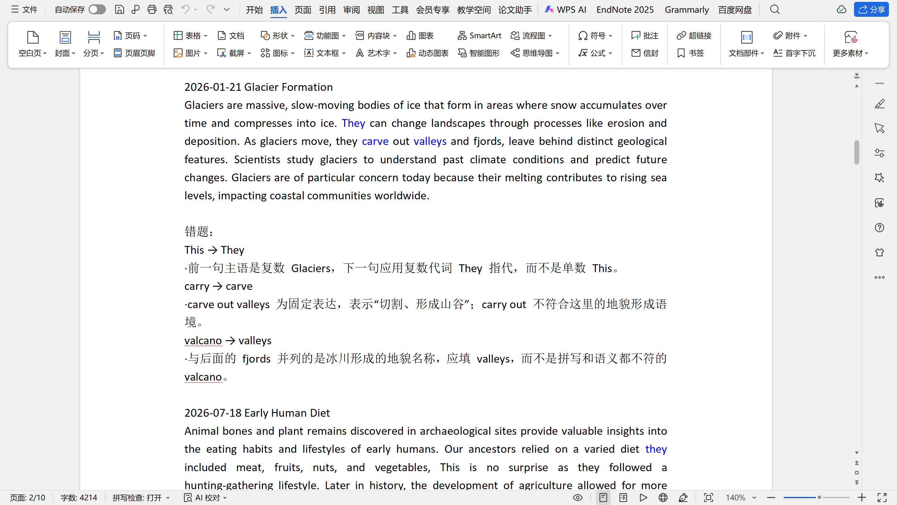

# 托福速通心得

## 背景

### 1.英语水平

高考 144 分，四六级半裸考（写过十套听力）都是五百八九十，大概是应试里比较优秀那一档。除了做题几乎没有接触英语，不看外文书也不看剧。

### 2.雅思/托福？

早年流传“托福听力难，雅思口语难”的说法，其实比较笼统。一方面得看院校的偏好，比如我觉得雅思7.0应该比托福4.5来得难。另一方面，有条件的话，最好还是两边各做一套完整的模考，看自己更喜欢哪种题型。

如果让我总结一个判断，我建议对真人口语对话没信心的考生选择托福。因为托福的口语相比雅思来说绝对更简单，它包括：

#### a.复述题：

托福口语半以上的分数来源是复述题，也就是听一个音频之后，尝试尽可能复述听到的句子。这部分是可以练习的，而且考场上有不小的概率碰见练过的原题。至于这前半部分，与其说是口语，不如说是听力加上瞬时记忆。

#### b.采访题：

给你讲一个问题，让你用 45 秒钟回答，总共四个层层递进的问题。比雅思的对话更公式一些。

而且真人打分的波动肯定比托福这种半自动判卷的来得大。如果你急着要成绩，或者不想考第二次，同样托福可能更稳定一些。

### 3.准备时间

其实我前后大概刷了一个月的题，但考虑到那阵子很忙，每天几乎只是抽很少的时间，可能也只相当于全职备考一周的工作量。

零散的时间我一般用来刷阅读填词、听力公告、口语复述。

有整段的时间就练听力讲座、完整的口语和写作。

### 4.报班与押题

我听了几节新东方的公开课，也看了一点B站上的视频，最后结论是对我来说用处都不大。因为报班会考虑一个比较平均的水平，而且我就算要报，重点突击的也该是口语和写作，一个综合性的培训班肯定不适合。

小红书上我也刷到了很多声称可以押题的帖子，我无聊联系了几个，得到的结果包括：

- a.通过中午让人回忆上午场的内容，来押下午场的题。可能有用，但价格不菲。

- b.给你随便整几套模拟题就说这是押题，一看 PDF 上一次修改时间还是几个月前，毫无用处。

我不是很清楚花大价钱有没有真货（我朋友说是有的），但便宜肯定找不着，建议老实点。

### 5.刷题

我用的是考拉考拉，小红书上有互助楼可以刷免费使用天数。充会员的话一个月也就100多，和我多掏的600多块转考费比起来简直不值一提。里头题目很多，我建议直奔真题开刷，因为考场上有非常大的概率做到原题，没必要去做模拟的题目。

下文分题型介绍的复习里，我会以考拉考拉的刷题经验为参照，讲模拟和实考的考试&评分区别。

## 备考过程

### 1.完整模考

没必要觉得“我先背几个邮件模板”或者“我先熟悉一下听力题型”再做完整考试，打开软件建议先来一场酣畅淋漓的裸考，定位到的问题才比较准确，比如作文没时间写，比如口语不知道怎么展开。

接下来会按照题型分门别类介绍，包括我对题目的理解、我个人觉得适合的刷题方法、考拉考拉刷题和实际考试的区别。

### 2.阅读

整体以吃老本为主，找回三成高中做题的手感就算请神上身成功了。

#### a.填词题

很类似高中的语法填空，个人感觉难度主要在两点：同一个开头对应的词太多，比如con-；词汇量太少，遇到根本不认识的生词要填（这种有时候上下文里会有同根词）。

解决方法是猛刷题，刷多了感觉就有了，什么非谓语什么从句的知识点就死而复生了。

而且多刷有更大的概率遇到原题。

如果真题里填空遇到不会的词一定要把它搞定，不然考场上又碰到血亏。

我很喜欢的一个错题整理方法是：在电脑上把含文本的错题截屏下来，存到一个文件夹里，然后让 Codex 帮忙整理到word里。效果如图：

错误原因分析有的时候比较笨，但总体来说还是很好用的。

反正做一套也就几分钟，也不需要耳机或者麦克风，没事干的时候多刷点。

#### b.文章题

正黄旗阅读题，我觉得没啥好说的，高考怎么练这个就怎么练。

有一点需要提前注意：考场上的答题形式是：左半边文本，右半边依次出现每一道题，选完确认，下一道题。所以不太方便做完之后再回头检查。

还有就是：最好提前熟悉整套题目的结构，不然还剩 5 分钟的时候你不知道后边是写完了还是剩了一整篇阅读，会有点心慌。

### 3.听力

主要也是吃老本，但它和高考听力蛮不一样的一点是：托福不是很爱考时间、地点这种特别细的细节。基本上听懂大意就可以了，不太会考你“衬衫是 9 镑 15 便士还是 9 镑 50 便士”。

#### a.问答题

这个也是没事干的时候练一练磨耳朵就行。

做模考的时候感觉挺简单的来着。实际考试因为是真人发音，会比模考里的更难一些。我模考5.5和6.0拿了不少，怀疑就是栽在这上边了，最后只有5.0。

#### b.对话题

如前所述，听懂大意就行。注意对话双方的态度以及某些信息的更新。

#### c.公告类

这个环节笔记可记可不记。开头几句话往往很重要，因为它决定了整篇内容的性质：到底是在发布一个新规定，还是更新一个旧规定。这类多半会在第一题考。总体而言也是听懂了就行。

#### d.讲座类

笔记基本需要从头记到尾。这个也很推荐刷真题，我在考场上就做到了平时写过的。因为对整篇文本已经比较熟悉了，做起来会轻松很多。

### 4.写作

我整体备考比较敷衍。临时抱佛脚的重点在于避免出现完全不会说的东西，而不是讲得有多好。

#### a.组句题

我个人感觉比较简单。除了一些涉及 that 的句子，结构可能稍微复杂一点，其他整体问题不大。

真实考试里那个词块特别难拖，我经常拖到线上，一松手它又弹回去，很烦。推荐预留更多的时间，因为会手滑。

#### b.邮件题

时间紧、任务重。和高考作文很不一样的一点是：宁可写简单、短小、正确的句子，也不要堆很多复杂句式。因为考试的时候根本来不及仔细思考，而且也没必要。

另外，一定要确认题目要求的三个任务点都按照顺序在正文里体现出来。可以一个任务点写一段，再适度补充一些细节。格式正确、任务完成，基本就没什么大问题。

我的练习程度是把考拉考拉里头不同主题的各练了一两篇，确保不会有关键句完全不知道怎么表达的情况（比如不知道怎么更正信息或者预定）

#### c.讨论题

我没怎么好好练过，就不乱说话了。个人感觉，一方面是要表达自己的观点，要有新的东西；另一方面可以适当呼应两位同学中的其中一个或两个，做他的补充或者反驳。

我同样是把考拉考拉里的几个主题各刷了一篇，确保不管碰上科技、人文、政策还是什么话题，都能掰扯上两句。

考拉考拉写作打分感觉还算凑合，甚至我感觉有点偏低。也可以用其他AI辅助评分来判断自己的水平。

### 5.口语

和写作类似，不要无话可说就行，短时间内很难练很好。

#### a.复述题

非常重要。我听说复述题在整个口语里的占比超过60%，而且大家口语普遍偏弱，又往往没做过类似的题目，所以很需要在考前专门练一下听力识别+短期记忆能力。

练习方式我建议直接刷真题。因为考场上如果做到原题完全血赚，我就这样。

单复数、时态这种小问题也会扣分。每道题给的时间一般都是充裕的，所以宁可在开始时多顿一秒想一下，或者整体语速放慢点，不要着急。

#### b.采访题

我自己没怎么准备，讲得也比较一般，所以只能说几个我觉得比较核心的点。

第一是注意时间分配。如果一道题有两个小问，一定要均衡分配时间，不要前一个讲太久，最后只剩 10 秒回答另一个。

第二是展开方式。我的建议是：

先直接回答问题 → 陈述理由 → 补充细节 → 最好再举个人的例子。

个人例子实在没有的话，编几个也行。

可以和ChatGPT练对话，功能还凑合。

对于口语的打分考拉考拉同样只能作为参考，其实感觉也是偏严厉了，真实作答能语法正确、有逻辑地讲40秒已经不错了，高级表达实在用不出来。

### 6.赌狗生存法则

#### a.口语复述题

我将推荐每一个考托福的人往死里刷口语复述。几分钟就能做完一套，但凡考场上做到了原题就相当于稳拿一半多的口语分数，性价比之王。

对于特定的主题词汇要熟悉，比如修车场景里的轮胎和工具，健身房里的器械等。单复数这种小细节，平时练的时候就不能放过。

一句话练到两三遍差不多已经够了，再往后就是你记住了句子，再练也没有意义。

#### b.听力讲座题

相比于其他你第一遍也能做对的短文本，这种长文本如果是考场上第二次见到，正确率肯定上升更显著。而且这也是比较真实的一个英语听力场景，所以练了不吃亏。

#### c.阅读填词题

核心思想同样是刷得快，而且考场遇到原题很划算。路上玩手机就能刷，不需要有多好的学习环境和多好的精神状态，反正你多刷就完事了。

#### d.其他

剩下的我觉得还是以练为目的，而不是指望押到原题。譬如阅读文章题，你就算这篇文章看过，考场上还是得再看一遍，能记住答案的概率不大。或者听力对话题，反正本来也不难，你做过了印象也不一定深刻。写作和口语的板块能遇到原题当然是好事，但是我觉得背基础的功能句模版也就够了，不必强求一模一样。

#### e.长期主义

如果你有三个月以上的时间我会推荐你背单词，毕竟单词是一切语言学习的基础。时间紧就算了。另外可以没事干听点播客，甚至直接看B站上国外大学的课程，反正是出国了也用得上的实用能力。
